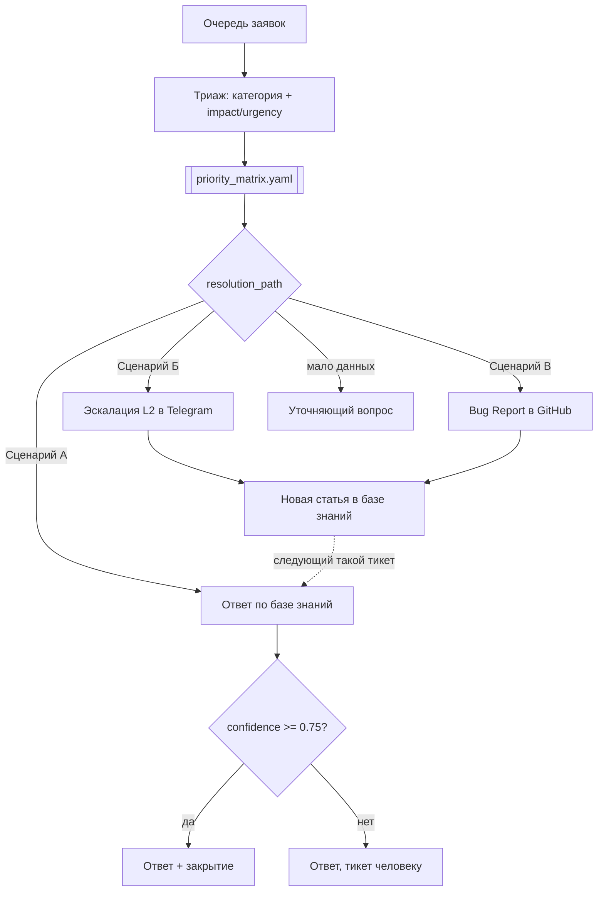

# ИИ-агент первой линии техподдержки

Автономный сотрудник L1: принимает заявку, восстанавливает истинную суть проблемы, ищет решение в базе знаний, отвечает пользователю, эскалирует инфраструктурные инциденты на L2, заводит баг-репорты в разработку и дописывает базу знаний по итогам нетиповых обращений.

> **Стек:** Claude Code как харнесс | 4 собственных MCP-сервера (22 инструмента) | политики как код | BM25-поиск без внешних зависимостей

---

## Ключевое наблюдение: что не так с исходными данными

Первым делом - анализ очереди. 100 заявок, и в них **`title`, `category` и `priority` не согласованы с `description`**:

| id | title | description | priority |
|----|-------|-------------|----------|
| 29 | Замятие бумаги | Компьютер пищит при включении и не загружается | Средний |
| 3 | Забыл пароль | Прошу сбросить пароль для учетной записи | **Критический** |
| 69 | Проблема с монитором | Компьютер пищит при включении и не загружается | Низкий |

Это типовая ситуация на первой линии: категория и приоритет проставляются на бегу и сути обращения не отражают. Отсюда два решения, определяющие всю систему:

1. **Источник истины - `description`.** В инструменты исходные поля приходят под именами `category_as_reported` и `priority_as_reported`: модель на уровне схемы данных видит, что доверять им нельзя.
2. **Приоритет вычисляется, а не назначается моделью.** У `classify_ticket` физически нет аргумента `priority` - только `impact` и `urgency`, дальше работает матрица. Иначе агент воспроизвёл бы тот же произвол, ради устранения которого его внедряют.

Расхождение исходной и восстановленной классификации - не побочный эффект, а бизнес-метрика: `queue_stats()` показывает, сколько заявок агент переклассифицировал.

---

## Как устроено

**As-Is:** специалист вчитывается в текст, переклассифицирует руками, ищет по Wiki глазами и дальше выбирает один из трёх сценариев - ответить по инструкции, тегнуть администратора в Telegram или завести Issue разработчикам. Написать новую статью по итогам он «должен, но на практике часто забывает».

**To-Be:**



Замкнутый контур `эскалация → решение → новая статья → автозакрытие` - этот шаг живой специалист может забывать.

```
.claude/agents/    определение виртуального сотрудника: роль, права, принципы
.claude/skills/    5 процедур L1: триаж, ответ по базе, эскалация, баг-репорт, самообучение
.mcp.json          регистрация MCP-серверов в харнессе
policies/          детерминированный слой: таксономия, матрица приоритетов, маршрутизация L2, ограничения
mcp_servers/       4 MCP-сервера = руки агента
  servicedesk/     очередь, триаж, ответы, статусы            7 инструментов
  knowledge_base/  BM25-поиск, чтение и создание статей       5 инструментов
  github_issues/   баг-репорты, поиск дубликатов, связка      5 инструментов
  telegram/        эскалация специалисту L2, ответы инженеров 5 инструментов
common/            store с shadow-overlay и аудитом, BM25-индекс
eval/              reference set + метрики качества
data/kb/           14 статей базы знаний
```

### Разделение труда между моделью и кодом

Модель делает то, что умеет только она: понимает текст и решает, о чём заявка. Всё вычислимое считает код - приоритет по матрице, выбор ответственного специалиста по `routing.yaml`, пороги автозакрытия, запрет ответа без ссылки на статью.

| Решение | Кто принимает |
|---|---|
| О чём заявка, оценка impact и urgency | модель |
| Итоговый приоритет | код - `priority_matrix.yaml` |
| Кому эскалировать | код - `routing.yaml` |
| Можно ли закрыть тикет | код - `guardrails.yaml` |
| Формулировка ответа пользователю | модель |

### Guardrails

| Ограничение | Где | Зачем |
|---|---|---|
| Ответ без `kb_article_ids` отклоняется | `reply_to_ticket` | нет источника - нет ответа |
| `confidence < 0.75` блокирует автозакрытие | `guardrails.yaml` | тикет уходит человеку, а не закрывается наугад |
| `confidence < 0.60` понижает маршрут до `NEED_INFO` | `classify_ticket` | лучше уточнить, чем угадать |
| Категория и приоритет - только из справочника | `taxonomy.yaml` | убирает произвол |
| Новые статьи создаются в статусе `draft` | `kb_create_article` | непроверенная инструкция хуже её отсутствия |
| Обязателен `source_reference` у новой статьи | `kb_create_article` | агент не выдумывает инструкции |
| Поиск дубликатов перед созданием Issue | `create_bug_report` | пятый одинаковый баг-репорт - та же рутина |
| Append-only аудит каждого решения | `data/shadow/audit.jsonl` | трассируемость и основа метрик |

Прав уровня L2 (перезапуск сервисов, выдача доступов) у агента нет - таких инструментов просто не существует в коде, поэтому он не может даже попытаться.

Изменения пишутся не в `mockapi` (публичный ресурс, состояние которого может испортить кто угодно), а в локальный `data/shadow/overlay.json` поверх снапшота: прогоны воспроизводимы, действия обратимы, исходное состояние доступно для сравнения. Реальная запись включается флагом `LIVE_WRITES=1` и по умолчанию выключена.

---

## Данные: что реально, а что смоделировано

Очередь заявок приходит из внешнего API. Корпоративные системы вокруг неё - Wiki, GitHub, Telegram - смоделированы локально: так прогоны воспроизводимы и не зависят от доступности внешних сервисов. Граница проведена явно, чтобы было понятно, какие выводы из метрик правомерны.

| Сущность | Происхождение |
|---|---|
| Очередь заявок, категории, приоритеты, статусы | **реальные** - внешний API, 100 заявок, 23 уникальных описания |
| База знаний, 14 статей | смоделировано - наполнение написано под фактический поток обращений |
| Специалисты L2, репозиторий разработки, SLA | смоделировано - `routing.yaml` |
| Матрица приоритетов и пороги | смоделировано - схема ITIL, веса подобраны под этот корпус |
| Ответы инженеров L2 | смоделировано - фикстура на 2 тикета для демо самообучения |
| Разметка reference set | тексты заявок настоящие, метки проставлены вручную |

---

## Результаты

Eval устроен в два уровня. Если поиск промахивается, модель сверху это не исправит - поэтому слой поиска меряется изолированно и раньше всего.

```
top-1 accuracy         17/17 = 100.0%     нужная статья на первом месте
top-3 accuracy         17/17 = 100.0%     нужная статья в топ-3
routing accuracy       21/23 =  91.3%     верно выбран сценарий А / Б / В
false-resolve          0                  закрытий тикета чужой статьёй
missed-resolve         2                  зря отдано человеку
```

**На что стоит обратить внимание:**

- **`top-1 accuracy = 100%` - верхняя граница, а не оценка качества базы знаний.** Метрика измеряет корректность индекса, а не полезность базы. Чтобы цифра стала диагностичной, нужна независимая разметка.
- **`false-resolve = 0` важнее, чем `missed-resolve = 2`:** нерелевантная инструкция стоит пользователю времени и доверия, лишняя передача человеку - только времени. Перекос порогов сделан сознательно.
- **Оба промаха - на теме паролей** (уверенность 0.73 при пороге 0.75). Нужная статья стоит первой: дело не в поиске, а в близости KB-001 и KB-002 - отрыв топ-1 от топ-2 схлопывается. Этот случай разрешает слой LLM: агент открывает обе статьи и выбирает по смыслу.

### Уровень 2 - агент целиком

Считается по журналу решений `data/shadow/audit.jsonl`, а не повторным прогоном модели: журнал уже содержит всё, что сделал агент. Замер по 10 заявкам, все три сценария задействованы.

```
category accuracy      10/10 = 100.0%     категория совпала с эталонной разметкой
route accuracy         10/10 = 100.0%     верно выбран сценарий А / Б / В
priority MAE           0.20 ступени       точное совпадение 8/10
grounding rate         6/6 = 100.0%       каждый ответ сослался на реальную статью
доля автозакрытий      4/6 =  66.7%       остальные ушли человеку на контроль
нарушений guardrails   0
```

Отдельно - что агент сделал с исходной классификацией. Голое «исправлено N значений» ничего не сообщает: ноль исправлений одинаково выглядит и когда чинить было нечего, и когда агент проспал весь беспорядок. Поэтому со знаменателем:

```
             было неверно   исправлено   пропущено   испорчено
категория        0/10            -           0           0
приоритет        6/10           5/6          1           1
```

Распределение: `KB_RESOLVE` 5 | `ESCALATE_L2` 2 | `BUG_REPORT` 3.

**Что подтвердил живой прогон:**

- **Теория из уровня 1 сработала на практике.** Три заявки про пароли получили от поиска уверенность 0.73 - ниже порога автозакрытия. Агент открыл обе близкие статьи, сослался на обе и поднял уверенность до 0.80-0.90. То есть пороговый слой честно сообщил «не уверен», а слой модели разрешил неоднозначность текстом, которого у BM25 не было. Обе величины остаются в журнале, поэтому решение проверяемо постфактум.
- **Защита от дубликатов отработала вживую.** Заявки 21 и 44 с идентичными описаниями дали **один** Issue с двумя связанными тикетами, а не два одинаковых баг-репорта.
- **Два расхождения по приоритету** оценочные, не ошибки механики: по заявке о скорости сетевой папки агент оценил охват более узко, чем разметка, по зависанию программы - более широко. Матрица в обоих случаях посчитала приоритет корректно из того, что ей передали.
- **Категорию исправлять было нечего:** всем десяти заявкам в очереди случайно достались верные ярлыки, и агент ни одного не испортил. Вся работа по наведению порядка пришлась на приоритеты - там неверными были 6 из 10.
- **Один приоритет агент испортил, один пропустил.** По заявке о зависании программы он поднял корректный «Низкий» до «Среднего», по заявке о скорости сетевой папки недооценил охват. Обе ошибки - в оценке impact и urgency, то есть ровно в той части, которую и должна делать модель, матрица из полученных значений посчитала приоритет верно. Это и есть граница между «ошибся человек» и «сломался механизм».

### Контур самообучения: замер до и после

Самый показательный результат прогона. Заявка «очень низкая скорость загрузки файлов из сетевой папки» ушла на вторую линию именно потому, что готовой инструкции не было. Инженер ответил, агент оформил решение статьёй KB-015 - и тот же запрос стал закрываться сам:

```
до появления статьи:   уверенность 0.58  →  ESCALATE_L2   (нужен инженер)
после:                 уверенность 0.97  →  KB_RESOLVE    (закрывается по инструкции)
```

Это и есть шаг, который живой специалист обычно пропускает: разовая эскалация превратилась в инструкцию, а следующее такое обращение уже не упадёт второй линии.

Статья создана в статусе `draft` и **в базовую линию уровня 1 не входит**: метрики поиска считаются только по проверенной человеком базе, иначе они менялись бы после каждого прогона и перестали быть сравнимыми. Агенту черновик при этом доступен сразу - разделение сознательное.

---

## Статус

| Компонент | Состояние |
|---|---|
| 4 MCP-сервера, 22 инструмента | готово |
| 4 файла политик | готово |
| Слой данных: overlay + журнал аудита | готово |
| BM25-поиск, 14 статей базы знаний | готово |
| `.mcp.json`, определение агента, 5 скиллов | готово |
| Метрики уровня 1 - слой поиска | готово |
| Метрики уровня 2 - агент по журналу решений | готово |

---

## Как запустить

```bash
make install     # uv sync - окружение и зависимости, Python 3.12
make snapshot    # снапшот очереди для воспроизводимых прогонов
make eval        # метрики слоя поиска - работают сразу, без LLM
```

Агент запускается внутри Claude Code из корня проекта. Серверы подхватываются из `.mcp.json` (при первом запуске Claude Code спросит подтверждение), роль - из `.claude/agents/`, процедуры - из `.claude/skills/`:

```bash
claude
> Обработай 5 новых заявок из очереди
```

Видно каждый вызов инструмента и каждое решение: триаж → поиск по базе → ответ, эскалация или Issue. Все действия пишутся в `data/shadow/audit.jsonl`.

После прогона по этому же журналу считаются метрики агента:

```bash
make eval-agent # метрики уровня 2 - категория, маршрут, приоритет, grounding
```

Сброс всех действий агента: `make reset`.

---

## Куда смотреть

### Слой агента - как он работает

| Файл | Что там |
|---|---|
| [agents/l1-support.md](.claude/agents/l1-support.md) | роль сотрудника: права, три нерушимых правила, когда звать человека. Список `tools` закрыт только MCP-инструментами - без файловой системы и терминала, чтобы ни одно действие не прошло мимо журнала |
| [skills/l1-triage](.claude/skills/l1-triage/SKILL.md) | как заявка своими словами превращается в категорию, impact, urgency и маршрут |
| [skills/l1-resolve-kb](.claude/skills/l1-resolve-kb/SKILL.md) | Сценарий А: статья читается целиком, ответ собирается из её шагов, не решает проблему - вернуться к маршрутизации, а не пересказывать ближайшую |
| [skills/l1-escalate-l2](.claude/skills/l1-escalate-l2/SKILL.md) | Сценарий Б: выжимка до 400 символов, запрет придумывать непроведённые проверки, ETA из реального SLA |
| [skills/l1-bug-report](.claude/skills/l1-bug-report/SKILL.md) | Сценарий В: дубликаты проверяются до создания Issue, каждый шаг воспроизведения следует из текста заявки |
| [skills/l1-kb-enrich](.claude/skills/l1-kb-enrich/SKILL.md) | самообучение: статья пишется от симптома, а не от причины - иначе её не найдёт следующий пользователь |

### Слой инструментов и политик - что вообще возможно

| Файл | Что там |
|---|---|
| [servicedesk](mcp_servers/servicedesk/server.py) | очередь, триаж, ответы, статусы. У `classify_ticket` намеренно нет аргумента `priority` |
| [knowledge_base](mcp_servers/knowledge_base/server.py) | поиск, чтение и создание статей, новые создаются только черновиками и требуют источника решения |
| [github_issues](mcp_servers/github_issues/server.py) | баг-репорты, поиск дубликатов встроен в создание, а не оставлен на усмотрение модели |
| [telegram](mcp_servers/telegram/server.py) | эскалация, ответственный подбирается по `routing.yaml`, а не выбирается моделью |
| [priority_matrix.yaml](policies/priority_matrix.yaml) | как приоритет считается вместо того, чтобы назначаться моделью |
| [guardrails.yaml](policies/guardrails.yaml) | пороги автономности агента |
| [common/store.py](common/store.py) | shadow-overlay и журнал аудита |
| [common/kb_index.py](common/kb_index.py) | BM25 и нормализация уверенности через отрыв топ-1 от топ-2 |
| [eval/reference_set.json](eval/reference_set.json) | ручная разметка 23 описаний, покрывающих все 100 тикетов |